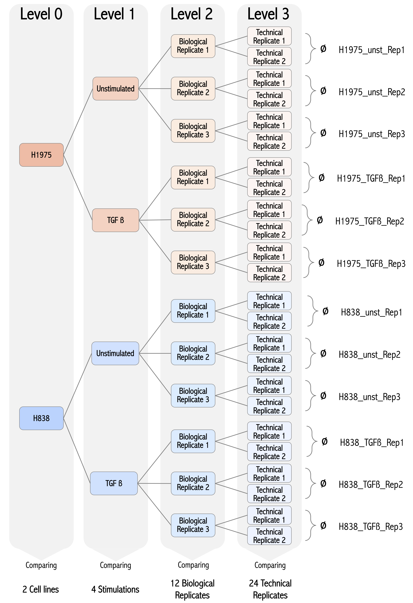
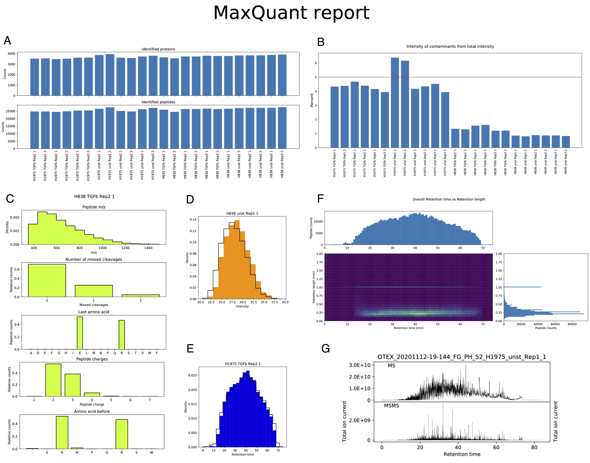
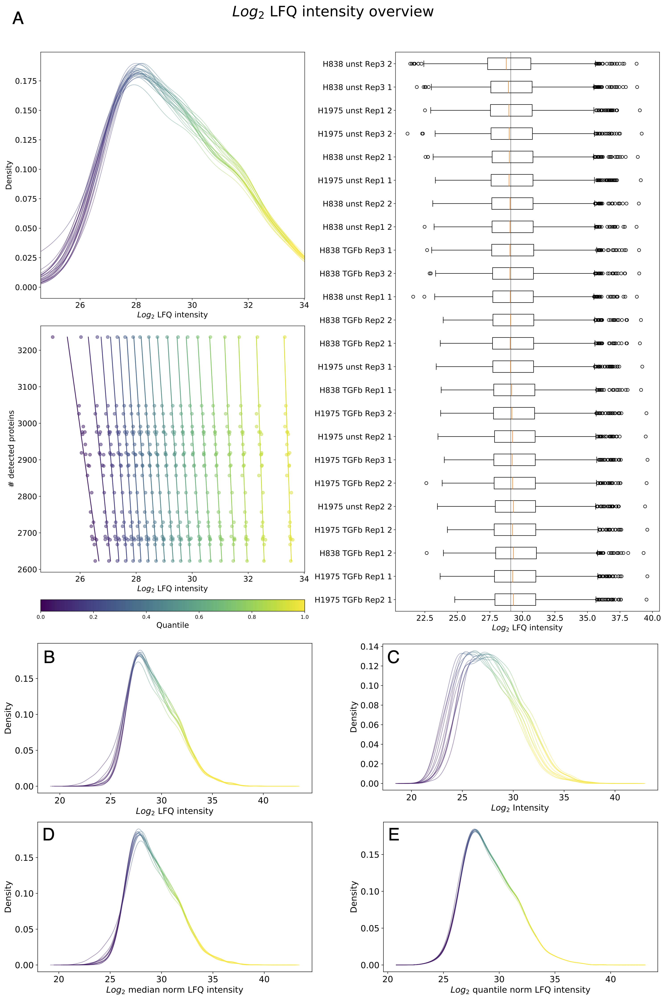
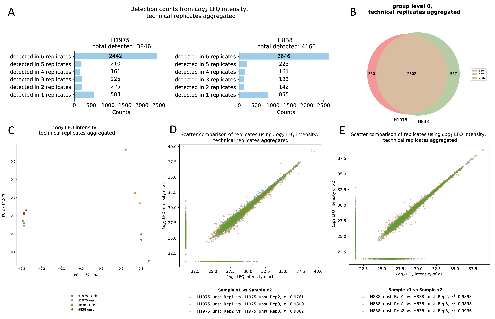
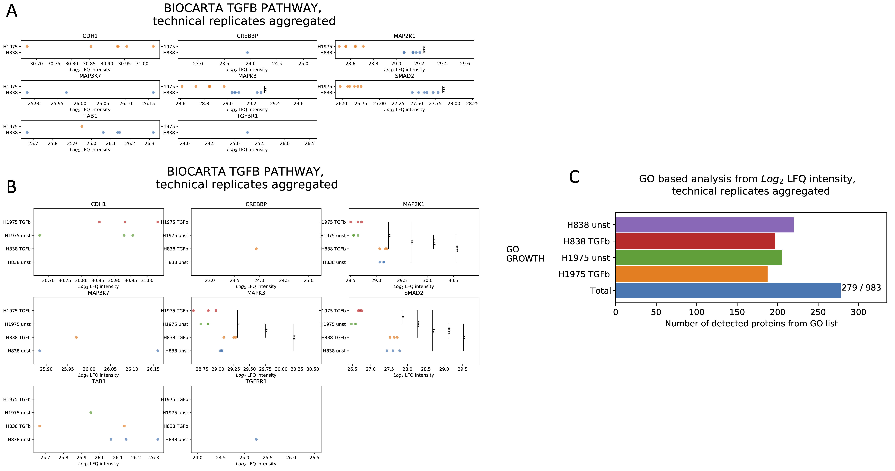

.. currentmodule:: mspypeline

.. _bio_analysis:

Benchmark dataset analysis
=============================

| *created: 01. June 2021*
| *version: 0.9.0*

| In the following section, a label-free whole proteome benchmark experiment is presented to introduce and exemplify the functionalities of ``mspypeline``. To demonstrate the analytical steps and statistical capabilities of our software, an experimental setup involving the stimulation of two lung cancer cell lines was designed.

**Label-free proteome comparison of two Non-small cell lung cancer (NSCLC) cell lines stimulated with transforming growth factor-beta (TGFβ).**

1. Introduction
^^^^^^^^^^^^^^^^

Non-small cell lung cancer (NSCLC) accounts for most lung cancer cases and is characterized by early metastasis and a high mortality rate. The multifunctional cytokine TGFβ is known for orchestrating tumor progression in NSCLC by activating its downstream pathway. However, the alterations behind TGFβ mediated tumor growth are not yet well understood. Thus, in this benchmark experiment, we examined the impact of TGFβ stimulation on the whole proteome of two different adenocarcinoma NSCLC cell lines, H1975 and H838. All acquired mass spectrometry-based proteomics data were analyzed exclusively with ``mspypeline``. As a result, we characterize the proteome of the two cell lines under two conditions, unstimulated and TGFβ stimulated for 24 hours. We also report on the possible molecular differences between the two cell lines and how these differences might lead to variable responses to TGFβ stimulation.

.. _setup:

    **Figure1. Experimental setup.** To recapture the experimental setup, the ``mspypeline`` package organizes the data in an internal tree structure. In total, 24 LC-MS runs were acquired, allowing samples to be assigned to four different analytical levels, (i) level 0 corresponds to the two NSCLC cell lines (H1975 and H838), (ii) level 1 corresponds to the stimulation conditions (Unstimulated, TGFβ stimulated), (iii) level 3 corresponds to biological replicates, and (iv) level 4 corresponds to three :ref:`technical replicates <tech-reps>`. Thus, we made use of this versatility to perform comparisons between the cell lines, stimulation conditions and biological replicates.

2. Materials and Methods
^^^^^^^^^^^^^^^^^^^^^^^^^^^^^^^^
The human NSCLC cell lines H1975 and H838 (ATCC) were grown in a humidified atmosphere with 5% CO2 at 37°C. Both cell lines were cultivated in DMEM (Lonza) supplemented with 10% FCS (Gibco) and 1% penicillin/streptomycin (Gibco). Moreover, cells were kept for 24 h in the presence or absence of transforming growth factor-beta (TGFβ). In total, three biological replicates per condition were prepared. After TGFβ stimulation, cells were lysed in a two-step process. Initially, RIPA buffer (containing 4% SDS, AP, AEBSF) was added, cells were centrifuged, and the supernatant was collected. The remaining pellet was suspended in Urea buffer (8 M, 2% SDS in TEAB) and centrifuged. Both fractions of the lysate were combined in a 1:1 ratio, and total protein concentration was assessed by the Bicinchoninic acid (BCA) assay. Further, samples were prepared to contain 20 µg of protein each and processed using the single-pot, solid-phase-enhanced sample preparation protocol (sp3), as previously described (Hughes et al. Nat Protoc, 2019). Briefly, protein disulfide bonds were reduced with 40 mM Tris (2-Carboxyethyl) Phosphine (TCEP), alkylated with 160 mM chloroacetamide at 95C for 5 min, and digested overnight (trypsin to protein ratio 1:25). The digested samples were dried down by vacuum centrifugation, and the resulting peptides were suspended in loading buffer (0.1% formic acid (FA), 2% ACN in H2O). Each biological replicate was prepared in duplicates to generate technical replicates. The Nano-flow LC-MS/MS analysis was performed by coupling an EASY-nLC 1000 to a Q Exactive Plus Orbitrap MS (both Thermo Scientific). Peptides were delivered to an analytical column (75 μm × 30 cm, packed in-house with Reprosil-Pur 120 C18-AQ, 1.9 μm resin, Dr. Maisch) at a flow rate of 3 μL/min in 100% buffer A (0.1% FA in H2O). After loading, peptides were separated using a 120 min gradient from 2% to 98% of solvent B (0.1% FA, 80% ACN in MS-compatible H2O; solvent A: 0.1% FA in MS-compatible H2O) at 350 nL/min flow rate. The Q Exactive Plus was operated in data-dependent mode (DDA), automatically switching between MS and MS2. Raw MS spectra were processed by MaxQuant (version 1.5.2.8), and the MS/MS spectra were searched against the Uniprot human reference proteome database (downloaded on November 6th, 2015) by Andromeda search engine, enabling contaminants and the reversed versions of all sequences with the following search parameters: Carbamidomethylation of cysteine residues as fixed modification and Acetyl (Protein N-term), Oxidation (M) as variable modifications. Trypsin/P was specified as the proteolytic enzyme with up to 2 missed cleavages allowed. The maximum false discovery rate for proteins and peptides was 0.01, and a minimum peptide length of six amino acids was required. Quantification mode with LFQ intensities was enabled. Downstream data analyses were performed using the python module of ``mspypeline``.

3. Results and Discussion
^^^^^^^^^^^^^^^^^^^^^^^^^^^^^^^^
To recapture the experimental setup, the ``mspypeline`` package organizes the data in an internal tree-structured :ref:`analysis design <analysis-design>` (:ref:`Fig. 1 <setup>`).

Quality Control Report
***************************
Quality assessment and quality control are crucial when dealing with mass spectrometry-based proteomics data. To detect measurement bias, verify consistency, and avoid error propagation in our downstream analysis, as a first step, the MaxQuant report was generated (view complete MaxQuant report here: `this document <./_static/MaxQuantReport.pdf>`_). It was observed that the total number of identified proteins and peptides (:ref:`Fig. 2A <report>`) was uniform, validating the reproducibility of our replicates. The degree of contamination of the individual samples can be observed in (:ref:`Fig. 2B <report>`). Interestingly, all the H1975 cell line replicates have substantially higher contamination levels than samples of the other cell line. Notably, two samples (technical replicate 1 and 2 of H1975 unstimulated replicate 1) exceeded the suggested maximum of 5% contaminated protein intensities and thus were handled with caution during subsequent analytical steps. Other important parameters to be considered during the dataset quality assessment include peptide m/z-distribution, number of missed cleavages, last amino acid, amino acid before cleavage, and peptide charges (:ref:`Fig. 2C <report>`). In the plots created by ``mspypeline``, the properties are shown for each sample separately and average distribution across all samples, denoted by a black line, was additionally provided to facilitate sample cross-comparison within the dataset. Furthermore, intensity and retention time distribution (:ref:`Fig. 2D, 2E <report>`), peptide counts and retention length vs. retention time (:ref:`Fig. 2F <report>`), and the total ion chromatogram (:ref:`Fig. 2G <report>`) were available and can be explored for all samples. Altogether, the results obtained indicated a high quality of our benchmark dataset.

.. _report:

    **Figure2. MaxQuant reports exemplary plots.** (A) The number of detected peptides and proteins displayed for each sample part of the benchmark dataset. (B) Percentage of protein intensities labeled as contamination from the total protein intensities for each sample in the benchmark dataset. (C) Overview of technical parameters inherent to sample processing (peptide m/z, number of missed cleavages, last amino acid, peptide charges, and amino acid before cleavage). These overview plots are generated for each sample included in the benchmark dataset; as an example sample, H838 TGFβ Rep2 1 is displayed. (D) Intensity histogram. Sample H838 unst Rep 1 1 is used as an example. (E) Retention time histogram. Sample H1975 TGFβ Rep2 1 is used as an example. The black outlines observed in plots (C), (D), (E) represent the dataset mean. (F) Heatmap and corresponding histogram of peptide retention time against the peptide retention length for all samples included in the dataset. (G) Graphic representation of MS and MS/MS spectra. Sample H1975 usnt Rep1 1 is used as an example.

Normalization Methods
***************************
The raw proteomics data obtained in our dataset can be normalized to produce more precise estimates of the underlying effects of the TGFβ stimulation on the proteome of NSCLC cell lines. Normalization strategies are typically applied to remove noise resulting from experimental and technical variations inherent to sample processing and mass spectrometry analysis. The ``mspypeline`` package offers different :ref:`normalization strategies <hyperparameter>`, and the opportunity to examine different aspects of the normalized dataset before proceeding with statistical analysis (:ref:`Fig. 3A<normalization>`). For example, in the Kernel density estimate (KDE) plot, one density graph per sample was created and indicates intensity on the x-axis and the density on the y-axis. By comparing the KDE plot of LFQ intensities (:ref:`Fig. 3B<normalization>`) and raw intensities (:ref:`Fig. 3C<normalization>`), the effect of the LFQ algorithm of MaxQuant (Cox et al. Mol Cell Proteomics, 2014) was evident; raw intensities showed a broader distribution than the LFQ intensities, especially in the low-intensity range. Furthermore, other normalization strategies applied to LFQ intensities were investigated. The quantile normalization appeared to be very rigorous, resulting in no variance among the samples due to the minimization of technical and biological variabilities. The median normalization, which is often applied when a constant shift of the intensity distributions between samples is be observed, did not affect the LFQ data.

.. _normalization:

    **Figure 3. Normalization overview for intensities.** (A) Normalization overview for log2 LFQ intensities for all 24 technical replicates. The normalization overview consists of three different plots, a kernel density estimate (KDE) diagram, a boxplot, and a graph representing the quantile proteins intensities against the number of detected proteins. (B) KDE plot of log2 LFQ intensities. (C) KDE plot of log2 raw intensities. (D) KDE plot of log2 LFQ intensities with median normalization applied. (E) KDE plot of log2 LFQ intensities with quantile normalization applied. For all KDE plots, technical replicates were averaged.

Another method to evaluate the applicability and improvements brought to the dataset by a normalization strategy is through an intensity heatmap (:ref:`Fig.4<heatmaps>`). The heatmap overview can be beneficial in understanding and spotting patterns that arise from biases introduced by data normalization. An apparent difference between the raw and LFQ intensities in our dataset was the distribution of missing values. The raw data contained substantially fewer missing values compared to the LFQ data. This observation was expected because the LFQ algorithm normalizes the data and removes values with low confidence.

After considering all aspects of data normalization, for further exploratory analysis of our dataset, the log2 LFQ intensity was chosen, and no additional normalization method was applied.

.. _heatmaps:
.. figure:: /savefig/intensity_heatmap_raw_log2.png
    :width: 700
    :align: center

.. figure:: /savefig/intensity_heatmap_lfq_log2.png
    :width: 700
    :align: center

    **Figure 4. Intensity heatmap.** (A)Heatmap representing log2 raw protein intensities with missing values shown in gray. It can be observed that replicates 1 and 3 of sample H1975 unstimulated and replicate 3of sample H838 unstimulated have fewer missing values than the other samples. (B)Heatmap representing log2 LFQ protein intensities with missing values shown in gray. Note the decrease in variability of the protein intensities across samples as well as the increase in missing values due to the LFQ algorithm.

Exploratory Analysis
***************************
In total, three biological replicates per cell line (H1975 and H838) were generated for two different stimulation conditions (unstimulated and TGFβ stimulated for 24 hours) and analyzed in technical duplicates, summing up to 24 samples. A total of 3846 proteins were quantified (LFQ intensity greater than 0) in H1975 cells, while 4160 proteins were quantified in H838 cells, considering all analyzed replicates (technical replicates not averaged) (:ref:`Fig.5A<outliers>`). The total number of proteins per replicate and their distribution within each group can be observed in :ref:`figure 5A<outliers>`. Considering the number of proteins identified in 6 out of 6 replicates, the proteomes of H1975 cells (2442 proteins) and H838 cells (2646 proteins) were observed to be different. A comparison of two cell lines is shown in :ref:`figure 5A<outliers>`. The Venn diagram shows 2302 proteins common to both cell lines. Further, around 300 proteins were uniquely detected in H1975 cells, whereas 500 proteins were uniquely detected in H838 cells. Even though both cell lines are NSCLC, a difference in their proteome composition was expected since their morphology is known to differ. Moreover, the versatility of the ``mspypeline`` package also made it possible to observe the number of identified proteins per stimulation condition, showing that the TGFβ stimulation leads to a slight decrease in the total number of identified proteins in both groups (12.2% and 13.6% less identification in H1975 and H838, respectively) (:ref:`Fig.5B<outliers>`).

To analyze cell type-specific and stimulated-induced differences in the abundance of proteins detected in both cell lines, a principal component analysis (PCA) was performed (:ref:`Fig.5C<outliers>`). The first principal component (PC) accounting for the most considerable variance (62, 1%) across samples was driven by the differential protein expression between the two cell lines. Spreading along PC2, the treatment conditions of the two cell lines separated the samples into two distinct groups, unstimulated and TGFβ stimulated. Moreover, biological replicates of H838 cells cluster closer together than replicates of H1975 cells. In line with this result, a lower variance in the H838 samples than in the H1975 samples was already observed in the MaxQuant report (figure 2). The reproducibility among the unstimulated biological replicates was investigated and is shown in (:ref:`figure 5D and 5E <outliers>`). The scatter plot depicts a pairwise comparison of protein intensities, and the Pearson correlation coefficient is given. The reproducibility of the unstimulated biological replicates is demonstrated for H1975 (average r2=0.97) (:ref:`Fig.5D<outliers>`) and for H838 (average r2=0.99) (:ref:`Fig.5E<outliers>`), in line with the PCA results.  Additionally, to unravel the impacts of TGFβ stimulation on the proteome of the two NSCLC cell lines, a list of curated proteins belonging to the canonical TGFβ pathway were analyzed (:ref:`see list of available pathways <pathway-proteins>`). As implemented in ``mspypeline``, pathway analysis is an optimal approach to gain an overview and better understanding of the expression patterns of proteins associated with a particular pathway or biological process. An intensity plot was created for each protein, and significances were calculated (pairwise t-test). A comparison of TGFβ pathway proteins in H1975 cells vs. H838 cells revealed a significant differential expression of MAP kinase proteins (MAP2K1, MAPK3) and SMAD2, an essential intracellular signaling component of the TGFβ pathway (:ref:`Fig.6A<pathways>`), when both H1975 and H838 cells were compared. Interestingly, when the pathway analysis was performed at the stimulation level, it was evident that TGFβ stimulation does not affect the expression of either MAP2K1 or MAPK3. The expression of SMAD2, however, was increased upon TGFβ stimulation in H1975 cells but not in H838 cells (:ref:`Fig.6B<pathways>`). Moreover, to perform enrichment analysis and retrieve additional functionality of our protein dataset, a gene ontology (GO) analysis was performed. An input list of categorized gene sets was given to ``mspypeline``, and statistical significances were calculated (one-tailed `Fisher exact test <https://docs.scipy.org/doc/scipy/reference/generated/scipy.stats.fisher_exact.html>`__). Since TGFβ is known for fostering tumor growth, the biological function term “growth” (GO: 0040007)(:ref:`see list of available GO terms <go-term-proteins>`), defined as the increase in size or mass of a cell, was investigated. This particular GO term comprises 983 genes, from which 279 were observed in our data set (:ref:`Fig.6C<pathways>`). At the stimulation level, the enrichment of this GO term was not statistically significant in any of our samples.

.. _outliers:

    **Figure 5. Outlier detection and comparison plots.** (A) Sample count (LFQ intensities greater than 0) on level 0 of the analysis (cell line comparison). Considering the number of proteins identified in 6 out of 6 replicates, the proteomes of H1975 cells (2442 proteins) and H838 cells (2646 proteins) differ. (B) Venn diagram comparing the detected proteins of H1975 and H838 cells. In total, 2302 proteins are common to both cell lines and 350 and 567 unique proteins to the H1975 cells and H838 cells, respectively. (C) PCA plot based on log2 LFQ intensities, performed at level 1 of the analysis comparing different stimulation conditions. PC1 (62.1%) is driven by the differential protein expression between the two cell lines, while stimulation conditions determine PC2. D) Pairwise scatter comparison plot showing the correlation (r2) between log2 LFQ protein intensities of H1975 unstimulated biological replicates. Unique proteins for each sample are indicated as a vertical (left) and horizontal (bottom) line and are imitted in account or the calculation of r2. The reproducibility of the biological replicates is demonstrated (average r2=0.97), ensuring reproducibility.

.. _pathways:

    **Figure 6. Statistical inference plots.** In total, eight proteins described as belonging to the canonical TGF-β pathway (Biocarta) were identified (LFQ intensities greater than 0) in at least one sample. The log2 LFQ intensities of each of the eight proteins are plotted, and significances are calculated between the pairwise comparisons of all groups from the selected level, given that at least three replicates per group have non-missing values for a particular protein. A) Pathway analysis performed on level 0, contrasting cell lines, grouping the six replicates. B) Pathway analysis performed on level 1, contrasting cell line-treatment conditions, grouping the three replicates. One star indicates p-value <0.05, two stars indicate p-value <0.01, and three stars indicate p-value <0.001. (C) GO analysis of the biological process term "growth" (GO: 0040007). Protein count for the analysis was performed using LFQ intensities. The number of detected proteins from a GO term found in each group/sample of level 1 of the ``mspypeline`` package analysis design is illustrated as the length of the corresponding bar. No significant enrichment was observed.

Differential Expression Analysis
*********************************
LFQ intensities were used for the differential expression analysis. Average fold changes between the cell lines were calculated, and statistical significance was assessed using the limma R package, which contains functionality specifically designed to handle high-dimensional biological data, implemented into ``mspypeline``. Thus, a volcano plot (:ref:`Fig. 7<volcanoplot>`) illustrates the significantly differentially expressed proteins between H1975 and H838 cells. A p-value (p<0.05) and a fold change (2-fold) cutoffs were specified, and all proteins below these values were considered as non-significant (1886 proteins). In total, 197 proteins were more abundant in H1975 cells, and whist 219 proteins were more abundant in H838 cells. Among the differentially regulated proteins, we observed mitochondria-related proteins such as PRDX2, OAT, TRAP1 in H1975 cells and DNM1L in H838 cells. Furthermore, the higher expression in H1975 cells of G6PD and PYGB, two key enzymes involved in energy metabolism, suggests that both cell lines are metabolically distinct. Interestingly, in H838 cells, BLMH, a peptidase responsible for the metabolic inactivation of the glycopeptide bleomycin, a molecule commonly used in chemotherapy (:ref:`Fig. 7<volcanoplot>`), is more abundant than in H1975 cells. Additionally, the intensities of unique proteins of a group are shown at the side of the volcano plot sorted according to their intensity (:ref:`Fig. 7<volcanoplot>`). Both H1975 and H838 cells present similar numbers of unique proteins, 197 and 229, respectively. Among the unique proteins expressed in H1975 cells, NES and TJP2 are the most intense and are implicated in proliferation and adherents junctions. The two most intense unique proteins expressed in H838 cells are UCHL1, involved in processing ubiquitin precursors and ubiquitinated proteins, and CES1, involved in the detoxification of xenobiotics.

In conclusion, in this benchmark dataset, we characterized the proteome of two commonly used NSCLC cell lines, H1975 and H838, under two different conditions, unstimulated and TGFβ stimulated for 24 hours. Our data showed that even though both cell lines are described as NSCLC, they differ in their proteome composition. This intrinsic proteomic discrepancy might determine how the two cell lines respond to TGFβ stimulation. The use of the ``mspypeline`` package and its functionalities made it possible to analyze the label-free mass spectrometry-based proteomics data seamlessly, thus, reaching meaningful biological conclusions swiftly. Most importantly, all used analytical parameters were stored, ensuring reproducibility if the analysis needed to be repeated.

.. _volcanoplot:
.. figure:: ./_static/volcano_H1975_H838_annotation_adjusted_p_value__lfq_log2.png
    :align: center

    **Figure 7. Volcano plot showing unique and differentially regulated proteins based on the pairwise comparison of the two cell lines H1975 and H838.** The log2 fold change of LFQ intensities was plotted against the adjusted −log10 (p-value). Dashed lines indicate the fold change cutoff (2 fold-change, and p < 0.05 by which proteins are considered significant (blue= H1975 and red = H838) or non-significant (gray). The ten most significant proteins of each group are annotated in the graph. Measured intensities of unique proteins are indicated at the sides of the volcano plot for both groups (light blue = H1975 and orange = H838).

