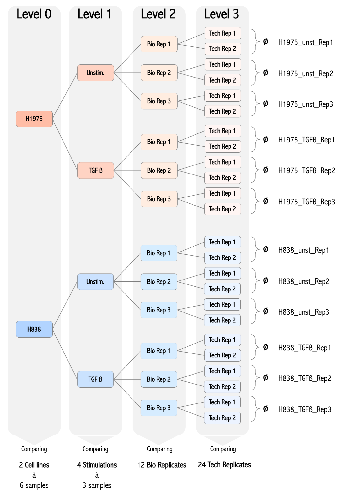
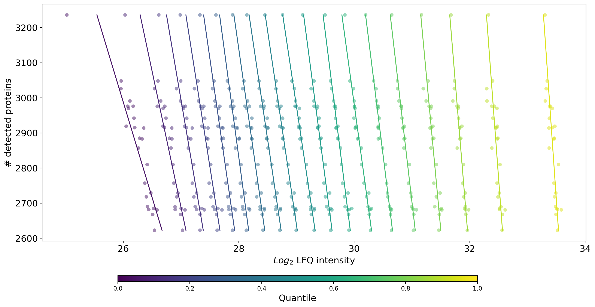
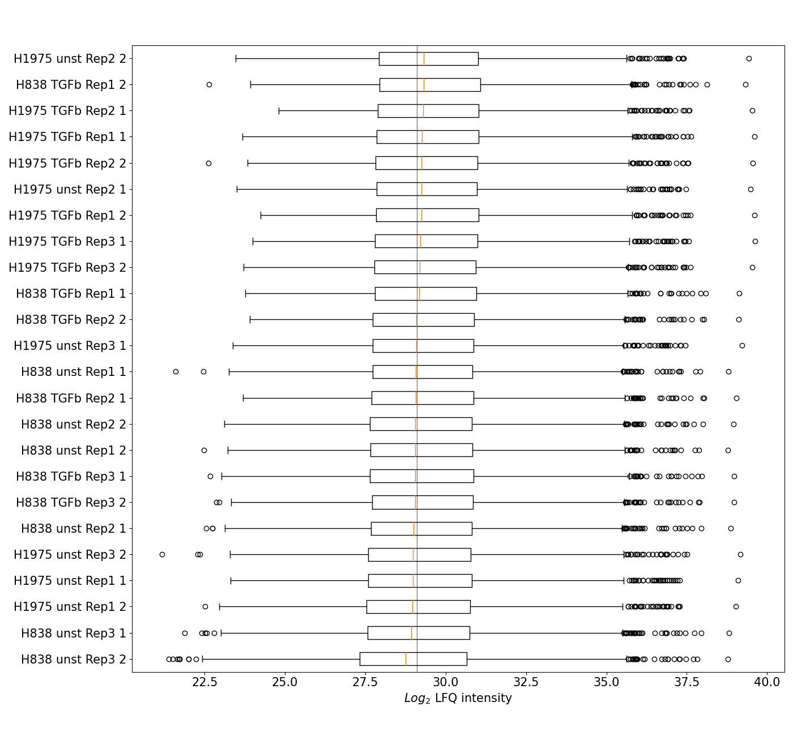
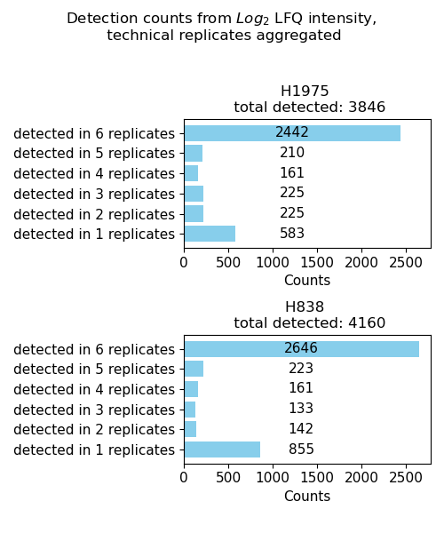
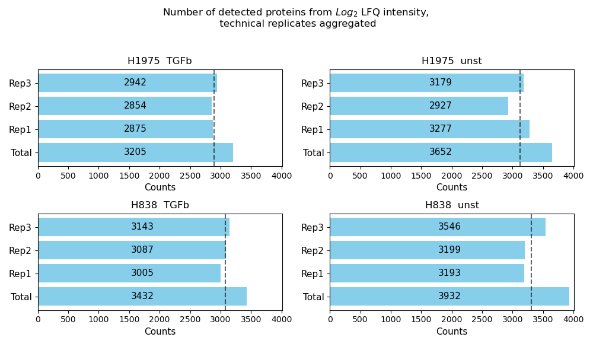
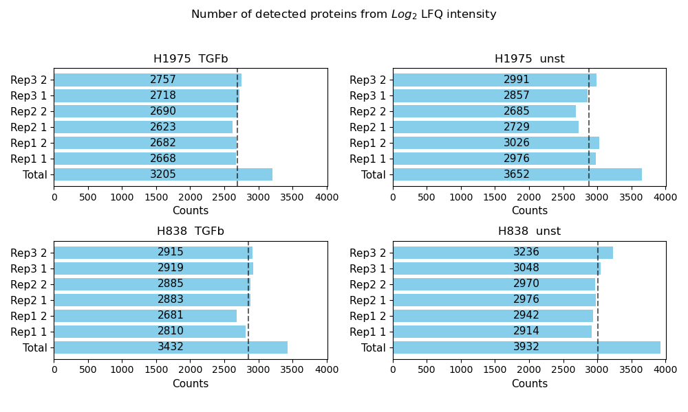
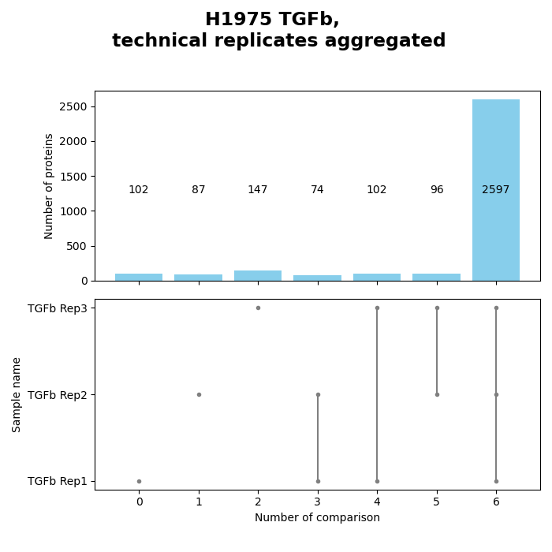

.. currentmodule:: mspypeline

.. _bio_analysis:

Benchmark dataset analysis
=============================

| *created: 01. June 2021*
| *version: 0.9.0*

Experiment setup
^^^^^^^^^^^^^^^^^
| In the following section, experimental data is presented to introduce and explain the functionalities of
  ``mspypeline`` in a visual format. Additionally it gives a minimal code example to create the plots as would be done when
  using the package as a :ref:`python module <python-quickstart>`. The experimental setup was specifically designed to
  facilitate the representation of the majority of analysis options provided by the software.

| Two different non-small cell lung cancer (NSCLC) **cell lines** H1975 and H838 were cultured in six culture dishes
  each. To create different **stimulation** conditions, three of a cell line’s **biological replicates** were
  treated with transforming growth factor beta (TGF-β) and three replicates remained unstimulated. For each of the twelve samples
  that were prepared for the MS analysis, two **technical replicates** were measured resulting in a total number of 24
  mass spectrometry runs. With this experimental arrangement, a multi-layered analysis design was established.
| For the analysis by ``mspypeline``, where samples are organized in a tree structure and addressed via their
  :ref:`level of analysis depth <analysis-design>`, the two cell lines correspond to the lowest **level 0**, to which
  six samples can be assigned each. In the next higher **level 1** of the analysis design, the two groups from level 0
  are further subdivided by their treatment condition such that there are now four different groups "H1975_unst",
  "H1975_TGFb", "H838_unst" and "H838_TGFb", all of which contain 3 replicates. In **level 2** these four groups are
  again subdivided now into the individual replicates. Since the measured protein intensities of
  :ref:`technical replicates <tech-reps>` are averaged and cumulated to the next lowest level, level 2
  becomes the highest level of analysis.

.. _maxquant-report-bio:

MaxQuant Report
^^^^^^^^^^^^^^^^^^^^^^^
| Created using: :meth:`~mspypeline.MaxQuantPlotter.create_report`

| The MaxQuant report offers a broad insight into the different sources of information from a MaxQuant output tables and
  it is specifically tailored to view aspects of mass spectrometry proteomic analysis.
| Besides the protein intensities (from the *proteinGroups.txt* file) which are the only source
  of data for all other parts of the analysis with the :ref:`MaxQuant Plotter <plotters>`, further information
  about experimental and technical parameters of the experiment are taken into account.
| The MaxQuant report can function as a data quality control tool and outputs a multi-page pdf document composed of
  a variety of information and graphics. Make sure that :ref:`all MaxQuant files <file-readers>` which are used to
  create the report are provided. In the following graphic, a gallery of selected plots is presented. To view the
  complete MaxQuant report, please view `this document <./_static/MaxQuantReport.pdf>`_.

.. figure:: ./_static/MaxQuantReport_example.pdf
    :width: 700
    :align: center

    **Gallery of exemplary plots from the MaxQuant report created with the benchmark dataset. **A)** Number of detected
    peptides and proteins for each sample presented together. **B)** Percentage of protein intensities labeled as
    contamination from the total protein intensities for each sample presented together. **C)** Overview of the
    technical parameters peptide m/z, number of missed cleavages, last amino acid, peptide charges and amino acid before
    cleavage for sample H838_TGF-β_Rep2_1. **D)** Intensity histogram for sample H838_unst_Rep1_1. **E)** Retention time
    histogram for sample H1975_TGF-β_Rep2_1. Black outlines in **C)**, **D)** and **E)** show the overall sample mean.
    **F)** Heatmap and corresponding histograms of the retention time against the retention length for all samples
    combined. **G)** Chromatogram of the *"MS scan"* and *"MSMS scan"* for sample H1975_unst_Rep1_1.

The resulting `MaxQuant Report <./_static/MaxQuantReport.pdf>`_.

Normalization Plots
^^^^^^^^^^^^^^^^^^^^

The helper function :meth:`~mspypeline.BasePlotter.plot_all_normalizer_overview` is used to generate the same plot
multiple times with different normalizations methods of the base data.

Normalization overview
***********************
| Created using: :meth:`~mspypeline.BasePlotter.plot_normalization_overview_all_normalizers` by calling
  :meth:`~mspypeline.BasePlotter.plot_normalization_overview`

| In the following, the three types of plots (:ref:`KDE <kde>`, :ref:`boxplot <boxplot>` and
  :ref:`proteins vs quantiles <proteins-vs-quantiles>`) that are used to create a normalization overview are shown
  separately and an exemplary analysis of each plot is given in the caption below. To view a full normalization
  overview, which is a multipaged pdf document combining all selected :ref:`normalization methods <hyperparameter>` for
  a chosen :ref:`intensity option <hyperparameter>` please see
 `this normalization overview example <./_static/normalization_overview_all_normalizers_raw_log2.pdf>`_.

.. figure:: /savefig/kde_raw_plot.png
    :width: 320
    :align: left

.. figure:: /savefig/kde_lfq_plot.png
    :width: 320
    :align: right

.. figure:: /savefig/kde_raw_trqn.png
    :width: 320
    :align: left

.. figure:: /savefig/kde_raw_trqn_missing.png
    :width: 320
    :align: right

**Exemplary kernel density estimate (KDE) plots showing the effect of different hyperparameter configurations.** In
every KDE plot, one density graph for each of the 24 technical replicates is plotted indicating the intensity on the
x-axis and the density on the y-axis. **Top left)** Log2 raw intensity without further normalization. **Top right)** Log2
LFQ intensity without further normalization. **Bottom left)** Log2 LFQ intensity with tail robust quantile normalization
applied. **Bottom right)** Log2 LFQ intensity with tail robust quantile normalization applied that handles missing values.
Comparing raw intensities (top left) and LFQ intensities (top right), the effect of the LFQ algorithm becomes evident,
which incorporates a normalization method to eliminate fractionation biases and a preliminary filter mechanism to
exclude outliers and proteins not reliable to ensure valid protein quantification. This is also reflected by the
broader distribution of raw intensity samples than the samples plotted with LFQ intensity, especially in the
low-intensity range. In the normalization overview KDE plots based on different normalization methods are generated
and saved in one pdf file which allows the comparison between the normalizers (e.g. as in the two bottom plots)
and enhances understanding about their effect on the data.

    **Graph plotting the quantile proteins intensities against the number of detected proteins in log2 LFQ intensities**
    **for all 24 technical replicates.** Every sample is indicated as a horizontal line of scatter dots where the color
    and x position of a dot point to the intensity value of the respective quantile. The y-position of the dots of a
    sample indicates the total number of detected proteins in that sample. Solid lines present a linear fit of each
    quantile for all the samples. Although the line orientation for the data presented here is primarily vertical, a
    shift to the left (samples with higher total protein count have a larger share of proteins with low intensities) can
    be observed for the lower quantiles. This correlation of relatively little protein counts and few low
    intensity-range proteins is frequently apparent in mass spectrometry data and reflects the effect of a detection
    limit which missing values increasingly arise for proteins of sparse intensity.

    **Boxplot displaying the five quantile distribution in log2 LFQ intensities for all 24 technical replicates and**
    **ranking the samples by median intensity from the bottom of the graph to the top.** Given the results from the
    counts vs quantiles plot which point towards a detection limit bias, the boxplot results have to be considered
    substantially influenced by high numbers of missing values in the low intensity-range which entails conversely high
    median values for these samples. Boxplot results from the experiment indicate such an effect. With respect to the
    detection limit, the boxplot results may give an indication of its source. Here, clustering of the technical
    replicates of a sample or the biological replicates of a group could point towards a decreased detection due to poor
    peptide concentration or adverse composition of the peptide matrix and ranking of the samples by their time of
    measurement could indicate increased detection limitation throughout the measurement runs as it can result from
    instrument pollution and wear-off. The experiment results presented show no signs of specific clustering or sorting
    of the samples and indicate rather random variability in the number and intensity of the detected proteins.

Heatmap overview
******************
| Created using: :meth:`~mspypeline.BasePlotter.plot_heatmap_overview_all_normalizers` by calling
  :meth:`~mspypeline.BasePlotter.plot_intensity_heatmap`.

| In the following, two seperate :ref:`intensity heatmaps <int-heatmap>` are presented that demonstrate how a potential
  analysis of the heatmap overview can be approached. To view a full heatmap overview, which is a multipaged pdf
  document combining all selected :ref:`normalization methods <hyperparameter>` for a chosen
  :ref:`intensity option <hyperparameter>` please see
  `this heatmap overview example <./_static/heatmap_overview_all_normalizers_raw_log2.pdf>`_.

.. note::
   If the heatmap seems blurred try downloading it and using a different PDF viewer

.. figure:: /savefig/intensity_heatmap_lfq_log2.png
    :width: 700
    :align: center

.. figure:: /savefig/intensity_heatmap_raw_log2.png
    :width: 700
    :align: center

    **Intensity heatmaps exposing the effect of different hyperparameter configurations in terms of protein intensities.**
    Intensity heatmaps depict protein intensities, whereby samples are given in rows on the y-axis and proteins on the x-axis.
    **Top)** Heatmap representing LFQ protein intensities with missing values shown in gray. Replicate 1 and 3 of sample
    unstimulated H1975 and replicate 3 of unstimulated H838 have notably fewer missing values than the other samples.
    Generally, samples of cell line H1975 appear to have more missing values compared to H838 samples. **Bottom)**
    Heatmap representing raw protein intensities and considerable less abundant missing values as found in LFQ
    intensities. Especially proteins with lower intensity are less abundant in the LFQ data. Sample H1975_unst_Rep1
    alone appears to have higher numbers of non missing values. Patterns of intensity value given in orange shades are
    detectable.

Outlier detection and comparison plots
^^^^^^^^^^^^^^^^^^^^^^^^^^^^^^^^^^^^^^^

Detection counts
*****************
| Created using: :meth:`~mspypeline.BasePlotter.plot_detection_counts`

    **Sample counts per detected protein using LFQ log2 intensities on level 0.** For both cell lines, i.e. groups of level
    0 (see :ref:`experimental setup <bio_analysis>`), the distribution appears similar. However, more proteins are found
    in one replicate of cell line H838, which is probably attributable to the H838_unst_Rep3, which has previously
    attracted attention due to a low number of missing values. Generally, high numbers of proteins present in all
    replicates (here six samples) are desirable. These results are an indication of the reproducibility of the
    individual samples of our data, which was already visible in the :ref:`MaxQuant report <maxquant-report-bio>`.

Number of detected proteins
****************************
| Created using: :meth:`~mspypeline.BasePlotter.plot_detected_proteins_per_replicate`

| The term "detected proteins" refers to the number of protein intensities greater than zero.
| Depending on whether :ref:`technical replicates <tech-reps>` should be averaged (top graph) or not (bottom graph) the
  data and resulting plot will have different outcomes. The number of detected proteins  per sample changes as 0 values
  are handled as missing values ("nan") and neglected when calculating the mean of samples.

    **Bar diagrams of the number of detected proteins per sample, using LFQ log2 intensities.** Presented are the results
    from the four groups of level 1 (see :ref:`experimental setup <bio_analysis>`) and a comparison is drawn
    between the analysis method handling technical replicates as individual samples (top) or averaging them to a single
    one (bottom). With the latter, protein counts per sample increase, but the total number of detected proteins is
    consistent.

Venn diagrams: comparing replicates vs. groups
***********************************************
| Venn diagram: created using: :meth:`~mspypeline.BasePlotter.plot_venn_results`
| Group diagram: created using: :meth:`~mspypeline.BasePlotter.plot_venn_groups`

| Venn diagrams conduce the graphical illustration of set theory. In ``mspypeline`` protein counts (greater than zero)
  constitute the sets and set relationships indicate the number of proteins that are shared between two or more sets.
  Thus, the similarity of detected proteins of a set can be assessed.
| The software distinguishes between two types of Venn diagrams:

* **Venn diagrams**, which compare the **group replicates of the selected level (here level 1) among one another** (plots on
  left side). For a level that has more than one group, a corresponding number of Venn diagrams are drawn.
* **Group diagrams**, where the **distinct groups of a level** are compared, aggregating the replicates of a group and
  applying a :ref:`threshold function <thresholding>` to the data. This function then determines which proteins are
  admissible for the group comparison and those that must be discarded.

| In addition to the ordinary Venn diagram (plots at the top), which is supporting a **maximum of three sets**, a
  bar-Venn diagram is created for every comparison (plots at the bottom). These hold the advantage of allowing an
  unlimited number of sets. The figure consists of two graphs, an upper bar diagram, that indicates the number of
  unique or shared proteins of a set or overlapping sets while the bottom graph points towards the sets that are being
  compared.
| Venn diagrams offer a means to vividly map the similarity of replicates and groups. Furthermore, this type of analysis
  is offering the chance to investigate the detected proteins per set and between sets in more detail. The corresponding
  information is displayed in tabular form and saved as a CSV file in addition to the Venn/group diagrams.It could, for
  example, be studied which proteins are unique to each cell line and which are detected in both of them (group diagram).

.. figure:: ./savefig/venn_plot1.png
    :width: 415
    :height: 202
    :align: left

.. figure:: /savefig/plots/venn_replicate_group_level_0_lfq_log2_level_0.png
    :width: 230
    :height: 202
    :align: right

.. figure:: /savefig/plots/venn_bar_group_level_0_lfq_log2_level_0.png
    :width: 190
    :height: 450
    :align: right

**Venn diagrams comparing the detected proteins of replicates and groups using LFQ log2 intensities. Left top)**
Ordinary Venn diagram and **bottom)** bar-Venn diagram, comparing the three replicates from the unstimulated condition
of cell line H1975 (level 1). **Right top)** Ordinary Venn diagram and **bottom)** bar-Venn diagram comparing the two
cell lines (level 0) by aggregating the detected proteins of each sample per group and applying a threshold function.

Principal Component analysis (PCA) overview
********************************************
| Created using: :meth:`~mspypeline.BasePlotter.plot_pca_overview`

| With the option to perform PCA, ``mspypeline`` allows data to be studied for its variance and in doing so, determine
  such parameters that have most strongly affected the variability between samples. Conversely, this implies, that using
  PCA, parameters can be identified which distinguish the samples from each other and it can be visualized which samples
  perform most similar.

.. figure:: /savefig/pca_overview_lfq_log2_level_1.png
    :width: 550
    :align: center

    **PCA scatter plot of log2 LFQ intensities performed at level 1 of the analysis comparing different treatment cell**
    **line combinations.** The calculation was performed without missing values and by normalizing with z-score
    transformation across all genes (see calculation adjustment options :ref:`here <default-yaml>`). The first principal
    component (PC) accounting for the largest variance across samples (62,1 %) is evidently driven by the differential
    protein expression between the two cell lines. The treatment conditions of the replicates from the two cell lines
    separate the data/samples further into unstimulated and TGF-β treated groups as indicated by a spread along the
    second PC.

Intensity histogram
********************
| Created using: :meth:`~mspypeline.BasePlotter.plot_intensity_histograms`

.. figure:: /savefig/intensity_hist.png
    :width: 550
    :align: center

    **Intensity histograms for each group of the selected level 1 displaying the distribution of binned intensity values**
    **for each replicate.** The mean intensity of the replicates of a group is shown as a gray dashed line. TGF-β treated
    replicates have a slightly higher mean intensity compared to unstimulated replicates. Sample H1975_unst_Rep1 and
    H838_unst_Rep3 stand out for having higher counts in low range intensities than the other replicates.

Relative standard deviation (std)
*********************************
| Created using: :meth:`~mspypeline.BasePlotter.plot_relative_std`

.. figure:: /savefig/relative_std.png
    :width: 500
    :align: center

    **The relative standard deviation of the 6 samples from level 0 group H838, plotted against the mean log2 LFQ**
    **intensity of a protein.** The relative standard deviation of the group demonstrates strong reproducibility
    of the 6 replicates as the values for all compared proteins are below the first threshold boundary of 10 %. Low
    deviation, as observed in our benchmark dataset for samples of the cell line H838, indicates that measured protein
    intensities are stable over multiple samples, thus supporting the reliability of and confidence in the data.
    Increasing variance among the proteins in the low-intensity range is commonly observed and demonstrates
    intensity-dependent biases. It is also visible that the inter-group variance is driven by generally similar values
    for most proteins, rather than by few proteins with extremely high relative standard deviation. To determine which
    proteins can be incorporated into the calculation of the mean intensity and relative standard deviation, an internal
    :ref:`threshold function <thresholding>` is applied which sorts out those proteins that have too many missing values
    across the compared samples.

Scatter comparison of replicates and groups
********************************************
| Scatter plot: created using: :meth:`~mspypeline.BasePlotter.plot_scatter_replicates`
| Experiment comparison: created using: :meth:`~mspypeline.BasePlotter.plot_experiment_comparison`

The software offers two types of scatter plots.

* **Scatter replicates plot**, which is calculating and plotting all pairwise comparisons between the replicates for each
  group of the selected level.
* **Group comparison plot**, which outlines how the different groups of the selected level compare with each other. For
  this purpose, protein intensities of the individual replicates of a group are combined and an internal :ref:`threshold
  function <thresholding>` is used to evaluate which of the proteins are assimilable and which are unique to the
  respective group.

.. figure:: /savefig/scatter_H838_unst_lfq_log2_level_1.png
    :width: 700
    :align: left

.. figure:: /savefig/scatter_comparison_H1975_vs_H838_lfq_log2_level_0.png
    :width: 570
    :align: left

    **Pairwise scatter comparison plots showing the correlation (r2) between log2 LFQ protein intensities of different
    sets of two samples.** Unique proteins for each sample are indicated as vertical (left) and horizontal (bottom) line
    of scatter dots and are not included in the calculation of r2. **Top)** Scatter replicates graph plotting the protein
    intensities for each combination of the three replicates from the unstimulated group H838. **Bottom)** Group comparison of the
    pairwise comparison of the two groups H838 and H1975 from level 0 by cumulating all samples of each group. The
    biological replicates of the unstimulated H838 group (top) correlate well (r2 values above 0.98 for all three
    pairwise comparisons) and substantially stronger, than the two cell lines (bottom). This effect can largely be
    explained by the different protein expression of the two NSCLC lines alone.

Rank
*****
| Created using: :meth:`~mspypeline.BasePlotter.plot_rank`

| For more precise addressing of the biological questions, it is usually helpful to group detected proteins into
  meaningful, expressive categories that are tailored to the respective issue. In the rank plot, where all proteins are
  sorted by intensity value and plotted against their rank, such lists of categorized proteins can be employed. Thus,
  statements can be made about the median intensity or rank of such classes of proteins. ``mspypeline`` provides a
  selection of pathway protein lists, however any desired :ref:`protein list <pathway-proteins>` may be integrated and
  used for the analysis.
| In the rank plot, the highest intensity accounts for rank zero the lowest intensity for the number of proteins - 1
  whereby proteins with missing values are neglected.

.. figure:: /savefig/rank_H1975_lfq_log2_level_0.png
    :width: 700
    :align: center

    **Rank plot of the mean log2 LFQ protein intensities of the H1975 group from level 0.** Annotated in the graph are
    ranked proteins from the "BioCarta EGF pathway" (blue, lower median rank) and the "HALLMARK IL2 STAT5 SIGNALING" pathway
    (orange, higher median rank). The median intensity of all proteins detected amounts to 28.2 log2LFQ intensity.

Statistical inference plots
^^^^^^^^^^^^^^^^^^^^^^^^^^^^

Pathway analysis
*****************
| Created using: :meth:`~mspypeline.BasePlotter.plot_pathway_analysis`

| Pathway analysis, of the kind implemented in ``mspypeline``, is an optimal approach to gain a better understanding of
  the measured intensities of proteins associated with a certain :ref:`pathway <pathway-proteins>` and can thus be used
  to conduct a quantitative comparison.
| For a group (H1975) of multiple samples (6 replicates), the protein intensity is plotted for each sample (single
  scatter dot) which are jointly presented in uniform coloring (orange). The effect of choosing different levels for the
  analysis on the results can be appreciated in the pathway analyses shown below. Both figures show the protein
  intensities of the :ref:`Biocarta EGF pathway <pathway-proteins>`, however calculation was performed for different
  :ref:`analysis levels <analysis-design>`. Here, the choice of the analysis depth determines which samples are
  considered a *"group"*.
| In the top figure where the analysis was performed on level 0 which consists of two groups (H1975 & H838), all samples
  belonging to any one of them are grouped together. In the bottom figure, where the analysis was performed on then next
  higher level (level 1), the two groups of level 0 are further subdivided into a total of four different groups to
  which (only) 3 samples are assigned.
| Statistical analysis are always performed between two *"groups"* of samples and require a minimum of 3 samples to
  indicate significances.

.. figure:: /savefig/pathway_analysis_level0.png
    :width: 700
    :align: center

.. figure:: /savefig/pathway_analysis_level1.png
    :width: 700
    :align: center

    **Analysis of the BioCarta EGF pathway performed on log2 LFQ protein intensities.** The intensities for each of the
    eight proteins of the pathway are plotted in groups. Significances are calculated between the pairwise comparison of
    all groups from the selected level, given that at least three replicates per group have non missing values for the
    protein. **Top)** Pathway analysis performed on level 0, contrasting cell lines, grouping the six replicates.
    **Bottom)** Pathway analysis performed on level 1, contrasting cell line-treatment conditions, grouping the three
    replicates.

GO analysis
************
| Created using: :meth:`~mspypeline.BasePlotter.plot_go_analysis`

| The GO enrichment analysis in ``mspypeline`` is calculated by extracting the number of proteins from a
  :ref:`GO term <go-term-proteins>` present in the total detected proteins of the experiment and in each group of the
  selected level. These counts are illustrated in a bar diagram (see below). To yield information on whether a protein
  count of a group may be of biological interest, a one-tailed
  `Fisher exact test <https://docs.scipy.org/doc/scipy/reference/generated/scipy.stats.fisher_exact.html>`__ is
  calculated to retrieve statistical significance. Importantly, the Fisher exact test includes information about the
  total number of detected proteins per sample, resulting in events of often unexpected significance for certain
  analysis groups.
| With the GO analysis targeted enrichment analysis is supported which is specifically well suited for making statements
  about selected :ref:`GO term <go-term-proteins>` of interest.

.. figure:: /savefig/go_analysis.png
    :width: 700
    :align: center

    **GO analysis of the terms "GO inflammatory response" and "GO apoptotic signaling pathway" based on protein counts**
    **of log2 LFQ intensities.** The number of detected proteins from a GO term found in each group of level 1 of the analysis
    design is illustrated as the length of the corresponding bar. P-values shown at the end of a bar indicate the
    calculated significance. Samples referred to as "Total" represent the complete data set and numbers at the top of
    the graph accord to the count of detected proteins in all samples over the total number of proteins in the GO term.
    Sample H1975_TGF-ß has a significant count of proteins from the "GO apoptotic signaling pathway" given the total
    number of proteins detected within the replicates of that sample.

Volcano plot (R)
*****************
| Created using: :meth:`~mspypeline.BasePlotter.plot_r_volcano`

| In proteomics, the volcano plot is commonly applied to demonstrate the differential protein expression of two groups.
| Here, the log2 fold change of the protein intensities is calculated and plotted against the −log10(p−value). A p-value
  and fold change cutoff is specified and all proteins below the cutoff are considered non-significant and colored in
  gray. Thereby, a straight-forward visual representation of the differential protein intensity measurements between the
  two contrasted groups can be obtained. Additionally, the intensities of unique proteins of a group are shown at the
  side of the volcano plot. Besides the most significant proteins or those characterized by large magnitude fold change,
  proteins unique to a group can reveal important details about protein expression or the composition of the peptide mix
  that was measured.
| To determine which proteins can be compared between the two groups and which are unique an internal
  :ref:`threshold function <thresholding>` is applied.
| Volcano charts permit the annotation of mapped proteins. This can either be achieved by labeling a number of the most
  significant proteins for each group (as for the example presented below) or by selecting a
  :ref:`pathway analysis list <pathway-proteins>`. The latter results in the exclusive annotation of proteins from the
  selected pathways. Given the information provided by the volcano plot a more in-depth analysis of pathways of interest
  or significantly high expressed and unique proteins per group can follow. By visualizing statistical inferences and
  highlighting relevant distinctions between two groups in combination with the integration of functional protein sets,
  the volcano plot thus provides a powerful tool to approach the biological objective.

.. figure:: ./_static/volcano_H1975_H838_annotation_adjusted_p_value__lfq_log2.png
    :align: center

    **Volcano plot illustrating the statistical inferences from the pairwise comparison of the two cell lines H1975 and**
    **H838.** The log2 fold change of LFQ intensities is plotted against the unadjusted −log10(p−value). Dashed lines
    indicate the fold change cutoff (log2(2) and p-value cutoff (p < 0.05) by which proteins are considered significant
    (blue = H1975 and red = H838) or non significant (gray). Here, the ten most significant proteins of each group are
    annotated in the graph. Measured intensities of unique proteins are indicated at the sides of the volcano plot for
    both groups (light blue = H1975 and orange = H838).

