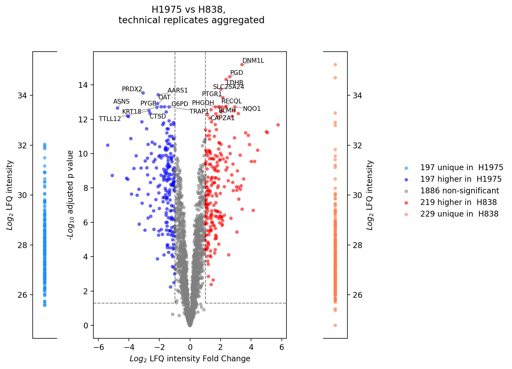

.. currentmodule:: mspypeline

.. _gallery:

Gallery
========

| In the following, all available :ref:`visualization options <Plot-Options>` are presented. Additionally, a minimal
  code example on how to create a :class:`~MaxQuantPlotter` using python is given, that is deployed to subsequently generate
  all following plots.
| For every generated graphic, a short description is provided that may be used to understand the underlaying calculations.
  A rather detailed, biological analysis is provided in :ref:`benchmark dataset analysis <bio_analysis>`, where the
  data structure and :ref:`analysis design <analysis-design>` of the :ref:`experimental samples <bio_analysis>` can be
  understood as well as possible evaluation approaches for the different plots.

Plotter creation
^^^^^^^^^^^^^^^^^
First, a plotter object has to be created to make the plots. Here, the :class:`~MaxQuantPlotter` is build from
the :class:`~MSPInitializer` class which creates and reads in the :ref:`configuration file <settings>` and initiates the
:class:`~MQReader` that loads the exemplary data set provided.

.. ipython:: python

    import pandas as pd
    import os
    from mspypeline import load_example_dataset, MaxQuantPlotter
    # load the data that is provided in a submodule
    init = load_example_dataset(configs={
        "has_techrep": True,
        "pathways": ["BIOCARTA_EGF_PATHWAY.txt", "HALLMARK_IL2_STAT5_SIGNALING.txt"],
        "go_terms": ["GO_APOPTOTIC_SIGNALING_PATHWAY.txt", "GO_INFLAMMATORY_RESPONSE.txt"]
        })
    plotter = MaxQuantPlotter.from_MSPInitializer(init)

    # create a second plotter without collapsed technical replicates
    init = load_example_dataset(configs={"has_techrep": False, "pathways":[]})
    plotter_with_tech_reps = MaxQuantPlotter.from_MSPInitializer(init)

define some helper functions and configurations

.. ipython:: python

    on_rtd = os.environ.get('READTHEDOCS', False) == 'True'
    static_dir = "./_static" if on_rtd else "./source/_static"
    savefig_dir = "./savefig" if on_rtd else "./source/savefig"

    def select_fig(plts, idx):
        # sets active figure which can then be saved by the @savefig decorator
        plt.figure(plts[idx][0].number)

.. _mqreport:

MaxQuant Report
^^^^^^^^^^^^^^^^^^^^^^^
| Created using: :meth:`~mspypeline.MaxQuantPlotter.create_report`

    | The MaxQuant report was built with the intention to offer a broad insight into the different sources of information
      from a MaxQuant output tables. Besides the protein intensities (from the *proteinGroups.txt* file) which are the only source
      of data for all other parts of the analysis with the :ref:`MaxQuant Plotter <plotters>`, further information
      about experimental and technical parameters of the experiment are taken into account.
    | The MaxQuant report can function as a data quality control tool and outputs a multi-page pdf document composed of
      a variety of information and graphics.
    | Make sure that :ref:`all MaxQuant files <file-readers>` which are used to create the report are provided.

    | For overview of plots see :ref:`analysis options <plotters>`

.. ipython:: python

    plotter.create_report(static_dir);
    # print("skipping report")

The resulting `MaxQuant Report <./_static/MaxQuantReport.pdf>`_.

Normalization Plots
^^^^^^^^^^^^^^^^^^^^

.. _norm-plots-gallery:

The helper function :meth:`~mspypeline.BasePlotter.plot_all_normalizer_overview` is used to generate the same plot
multiple times with different normalizations methods of the base data.

.. _norm-overview:

Normalization overview
***********************
| Created using: :meth:`~mspypeline.BasePlotter.plot_normalization_overview_all_normalizers` by calling
  :meth:`~mspypeline.BasePlotter.plot_normalization_overview`

.. autodescriptiononly:: mspypeline.BasePlotter.plot_normalization_overview

.. ipython:: python

    plotter.plot_normalization_overview_all_normalizers("raw_log2", 0, save_path=static_dir);
    # print("skipping norm overview")

View `this normalization overview example <./_static/normalization_overview_all_normalizers_raw_log2.pdf>`_.

.. _heatmap-overview:

Heatmap overview
******************
| Created using: :meth:`~mspypeline.BasePlotter.plot_heatmap_overview_all_normalizers` by calling
  :meth:`~mspypeline.BasePlotter.plot_intensity_heatmap`.

.. autodescriptiononly:: mspypeline.BasePlotter.plot_heatmap_overview_all_normalizers

.. note::
   If the heatmap seems blurred try downloading it and using a different PDF viewer

.. ipython:: python

    plotter.plot_heatmap_overview_all_normalizers("raw_log2", 0, vim=19.5, vmax=40, save_path=static_dir);
    # print("skipping heatmap overview")

View `this heatmap overview example <./_static/heatmap_overview_all_normalizers_raw_log2.pdf>`_.

Outlier detection and comparison plots
^^^^^^^^^^^^^^^^^^^^^^^^^^^^^^^^^^^^^^^
.. _detection-counts:

Detection counts
*****************
| Created using: :meth:`~mspypeline.BasePlotter.plot_detection_counts`

.. autodescriptiononly:: mspypeline.BasePlotter.plot_detection_counts

.. ipython:: python

    @savefig detection_counts.png width=400 align=center
    plotter.plot_detection_counts("lfq_log2", 0, save_path=None);

.. _detected-proteins:

Number of detected proteins
****************************
| Created using: :meth:`~mspypeline.BasePlotter.plot_detected_proteins_per_replicate`

.. autodescriptiononly:: mspypeline.BasePlotter.plot_detected_proteins_per_replicate

    | Depending on whether :ref:`technical replicates <tech-reps>` should be averaged (top graph) or not
      (bottom graph) the data and resulting plot will have different outcomes. The number of detected proteins  per sample changes as 0 values are handled as missing values ("nan") and neglected when calculating the mean of
      samples.

.. ipython:: python

    @savefig detected_proteins.png width=600 align=center
    plotter.plot_detected_proteins_per_replicate("lfq_log2", 1, save_path=None);

    @savefig detected_proteins_tech_rep.png width=600 align=center
    plotter_with_tech_reps.plot_detected_proteins_per_replicate("lfq_log2", 1, save_path=None);

.. _venn-rep:

Venn diagrams
**************
| Created using: :meth:`~mspypeline.BasePlotter.plot_venn_results`

.. autodescriptiononly:: mspypeline.BasePlotter.plot_venn_results

.. ipython:: python

    plots = plotter.plot_venn_results("lfq_log2", 1, close_plots=None, save_path=None)

    @savefig venn_plot1.png width=600 align=center
    select_fig(plots, 0);

    @savefig venn_plot2.png width=450 align=center
    select_fig(plots, 1);

.. _venn-group:

Group diagrams
***************
| Created using: :meth:`~mspypeline.BasePlotter.plot_venn_groups`

.. autodescriptiononly:: mspypeline.BasePlotter.plot_venn_groups

.. ipython:: python

    plotter.plot_venn_groups("lfq_log2", 0, close_plots=None, save_path=savefig_dir, fig_format=".png");

.. image:: /savefig/plots/venn_replicate_group_level_0_lfq_log2_level_0.png
    :width: 440
    :height: 400
    :align: left

.. image:: /savefig/plots/venn_bar_group_level_0_lfq_log2_level_0.png
    :width: 200
    :height: 400
    :align: right

.. _pca:

Principal Component analysis (PCA) overview
********************************************
| Created using: :meth:`~mspypeline.BasePlotter.plot_pca_overview`

.. autodescriptiononly:: mspypeline.BasePlotter.plot_pca_overview

.. ipython:: python

    plotter.plot_pca_overview("lfq_log2", 1, save_path=savefig_dir, fig_format=".png");

.. image:: /savefig/pca_overview_lfq_log2_level_1.png
    :width: 550
    :align: center

.. _int-hist:

Intensity histogram
********************
| Created using: :meth:`~mspypeline.BasePlotter.plot_intensity_histograms`

.. autodescriptiononly:: mspypeline.BasePlotter.plot_intensity_histograms

.. ipython:: python

    @savefig intensity_hist.png width=600 align=center
    plotter.plot_intensity_histograms("lfq_log2", 1, save_path=None);

.. _rel-std:

Relative standard deviation (std)
**********************************
| Created using: :meth:`~mspypeline.BasePlotter.plot_relative_std`

.. autodescriptiononly:: mspypeline.BasePlotter.plot_relative_std

.. ipython:: python

    @savefig relative_std.png width=500 align=center
    plotter.plot_relative_std("lfq_log2", 0, save_path=None);

.. _scatter-rep:

Scatter replicates
*******************
| Created using: :meth:`~mspypeline.BasePlotter.plot_scatter_replicates`

.. autodescriptiononly:: mspypeline.BasePlotter.plot_scatter_replicates

.. ipython:: python

    plotter.plot_scatter_replicates("lfq_log2", 1, save_path=savefig_dir, fig_format=".png");

.. image:: /savefig/scatter_H838_unst_lfq_log2_level_1.png
    :width: 700
    :align: center

.. _scatter-group:

Experiment comparison
**********************
| Created using: :meth:`~mspypeline.BasePlotter.plot_experiment_comparison`

.. autodescriptiononly:: mspypeline.BasePlotter.plot_experiment_comparison

.. ipython:: python

    plotter.plot_experiment_comparison("lfq_log2", 0, save_path=savefig_dir, fig_format=".png");

.. image:: /savefig/scatter_comparison_H1975_vs_H838_lfq_log2_level_0.png
    :width: 650
    :align: center

.. _rank:

Rank
*****
| Created using: :meth:`~mspypeline.BasePlotter.plot_rank`

.. autodescriptiononly:: mspypeline.BasePlotter.plot_rank

.. ipython:: python

    plotter.plot_rank("lfq_log2", 0, save_path=savefig_dir, fig_format=".png");

.. image:: /savefig/rank_H1975_lfq_log2_level_0.png
    :width: 700
    :align: center

Statistical inference plots
^^^^^^^^^^^^^^^^^^^^^^^^^^^^
.. _pathway-analysis:

Pathway analysis
*****************
| Created using: :meth:`~mspypeline.BasePlotter.plot_pathway_analysis`

.. autodescriptiononly:: mspypeline.BasePlotter.plot_pathway_analysis

| The effect of choosing different levels for the analysis on the results can be appreciated in the pathway analyses
  shown below. Both figures show the protein intensities of the :ref:`Biocarta EGF pathway <pathway-proteins>`, however
  calculation was performed for different :ref:`analysis levels <analysis-design>`. Here, the choice of the analysis
  depth determines which samples are considered a *"group"*.
| In the top figure where the analysis was performed on level 0 which consists of two groups (H1975 & H838), all samples
  belonging to any one of them are grouped together.
| In the bottom figure, where the analysis was performed on then next higher level (level 1), the two groups of level 0
  are further subdivided into a total of four different groups to which (only) 3 samples are assigned.
| Statistical analysis are always performed between two *"groups"* of samples and require a minimum of 3 samples to
  indicate significances.

.. ipython:: python

    plots_level0 = plotter.plot_pathway_analysis("lfq_log2", 0, close_plots=None, save_path=None)
    plots_level1 = plotter.plot_pathway_analysis("lfq_log2", 1, close_plots=None, save_path=None)

    @savefig pathway_analysis_level0.png width=700 align=center
    select_fig(plots_level0, 0);

    @savefig pathway_analysis_level1.png width=700 align=center
    select_fig(plots_level1, 0);

.. _go-analysis:

Go analysis
************
| Created using: :meth:`~mspypeline.BasePlotter.plot_go_analysis`

.. autodescriptiononly:: mspypeline.BasePlotter.plot_go_analysis

.. ipython:: python

    @savefig go_analysis.png width=700 align=left
    plotter.plot_go_analysis("lfq_log2", 1, save_path=None);

.. _volcano:

Volcano plot (R)
*****************
| Created using: :meth:`~mspypeline.BasePlotter.plot_r_volcano`

.. autodescriptiononly:: mspypeline.BasePlotter.plot_r_volcano

    | In the here shown volcano plot, the 10 most significant proteins for each group are annotated. However, if proteins
      of a specific pathway should be annotated, this can be achieved by selecting one or more
      :ref:`pathway lists <pathway-proteins>`.

.. ipython:: python

    print("pass")
    # plotter_with_tech_reps.plot_r_volcano("lfq_log2", 0, sample1="H1975", sample2="H838", adj_pval=True, save_path=savefig_dir, fig_format=".png");

Additionally via python
^^^^^^^^^^^^^^^^^^^^^^^
.. _kde:

Kernel density estimate plot
*******************************
| Created using: :meth:`~mspypeline.BasePlotter.plot_kde`

.. autodescriptiononly:: mspypeline.BasePlotter.plot_kde

    | In the figure shown below, the effect of the two different protein intensity types is presented.
      The two top graphs show the *"raw"* and *"lfq"* intensities, while the two bottom graphs demonstrate the data preprocessed with
      two different normalizations *"tail robust quantile normalization"* and
      *"tail robust quantile normalization with missing value handling"*.
    | The KDE can thus help to understand how intensity types or normalization methods may influence the data.

.. ipython:: python

    plotter.add_normalized_option("raw", plotter.normalizers["trqn"], "trqn")
    plotter.add_normalized_option("raw", plotter.normalizers["trqn_missing_handled"], "trqn_missing_handled")

    @savefig kde_raw_plot.png width=320 align=left
    plotter.plot_kde("raw_log2", 3, save_path=None);

    @savefig kde_lfq_plot.png width=320 align=right
    plotter.plot_kde("lfq_log2", 3, save_path=None);

    @savefig kde_raw_trqn.png width=320 align=left
    plotter.plot_kde("raw_trqn_log2", 3, save_path=None);

    @savefig kde_raw_trqn_missing.png width=320 align=right
    plotter.plot_kde("raw_trqn_missing_handled_log2", 3, save_path=None);

.. _boxplot:

Boxplot
********
| Created using: :meth:`~mspypeline.BasePlotter.plot_boxplot`

.. autodescriptiononly:: mspypeline.BasePlotter.plot_boxplot

.. ipython:: python

    @savefig boxplot.png width=700 align=center
    plotter.plot_boxplot("lfq_log2", 3, save_path=None);

.. _proteins-vs-quantiles:

Number of Proteins vs Quantiles
********************************
| Created using: :meth:`~mspypeline.BasePlotter.plot_n_proteins_vs_quantile`

.. autodescriptiononly:: mspypeline.BasePlotter.plot_n_proteins_vs_quantile

.. ipython:: python
    :okwarning:

    plotter.plot_n_proteins_vs_quantile("lfq_log2", 3, save_path=savefig_dir, fig_format=".png");

.. image:: /savefig/n_proteins_vs_quantile_lfq_log2_level_3.png

.. _int-heatmap:

Intensity Heatmap
******************
| Created using: :meth:`~mspypeline.BasePlotter.plot_intensity_heatmap`

.. autodescriptiononly:: mspypeline.BasePlotter.plot_intensity_heatmap

    | In the heatmap shown below, samples are sorted by the number of missing values and proteins are ranked by the number
      of missing values across all samples. So, depending on the defined preferences, the heatmap can, for instance, be
      used to gather information about the distribution of missing values or the influence of the normalization method by
      the appearance of patterns.

.. ipython:: python

    @savefig intensity_heatmap_lfq_log2.png width=700 align=center
    plotter.plot_intensity_heatmap("lfq_log2", 2, sort_index_by_missing=True, sort_columns_by_missing=True, save_path=None);

    @savefig intensity_heatmap_raw_log2.png width=700 align=center
    plotter.plot_intensity_heatmap("raw_log2", 2, sort_index_by_missing=True, sort_columns_by_missing=True, save_path=None);

