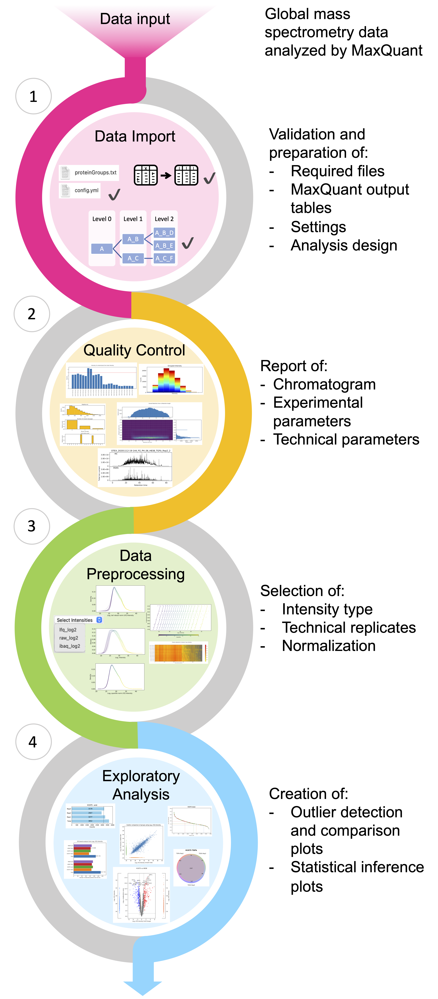

.. MSPypeline documentation master file, created by
   sphinx-quickstart on Fri Apr 10 12:03:31 2020.
   You can adapt this file completely to your liking, but it should at least
   contain the root `toctree` directive.

Welcome to MSPypeline's documentation!
======================================

``mspypeline`` is a package for analysing mass spectrometry-based proteomics data.
The source code is available on `github <https://github.com/siheming/mspypeline/>`__.

Usage
=====

| ``mspypeline`` was developed for the analysis of proteomic data generated by **MaxQuant** to provide a
  tool to analyze complex datasets in a standardized manner with minimal effort and to eliminate the chance of human
  error or obscuring variability during data analysis.
| Designed with an intuitive and concise graphical user interface (GUI), ``mspypeline`` offers researchers,
  unfamiliar with programming or data analysis, the opportunity to explore and visualize their data independently and in
  a time-effective manner. A structured workflow (see figure to the right) can be followed to perform a comprehensive and
  conclusive analysis that starts with quality control of the data, followed by the assessment and choice of
  data preprocessing operations to finally allow optimal exploratory analysis. By automizing the calculations and the
  generation of versatile figures, ``mspypeline`` supports data analysis within minutes.
  Simultaneously, the more experienced user may interact closer with the ``mspypeline`` package to perform advanced
  analysis exploiting the plethora of customization options.
| Standardization and reproducibility of the analysis are ensured by the automated logging of all analysis settings and
  saving them to a separate configuration file.
| Thus, ``mspypeline`` provides a platform that supports users in their proteomics data analysis generated by mass spectrometry
  by giving insight into the data, offering parameter adaptation when needed, generating custom figures and performing
  differential expression analysis and hypothesis testing to reach biologically relevant conclusions.
| Please refer to the other parts of the documentation for :ref:`installation <installation>`,
  :ref:`how to get started <get-started>`, or use the search.

.. toctree::
   :maxdepth: 2
   :caption: Contents

   installation
   get_started
   workflow
   file_readers
   analysis_options
   settings_and_configuration
   package_config
   examples
   gallery
   examplary_bio_analysis
   API <api_reference/index>

Indices and tables
==================

* :ref:`genindex`
* :ref:`modindex`
