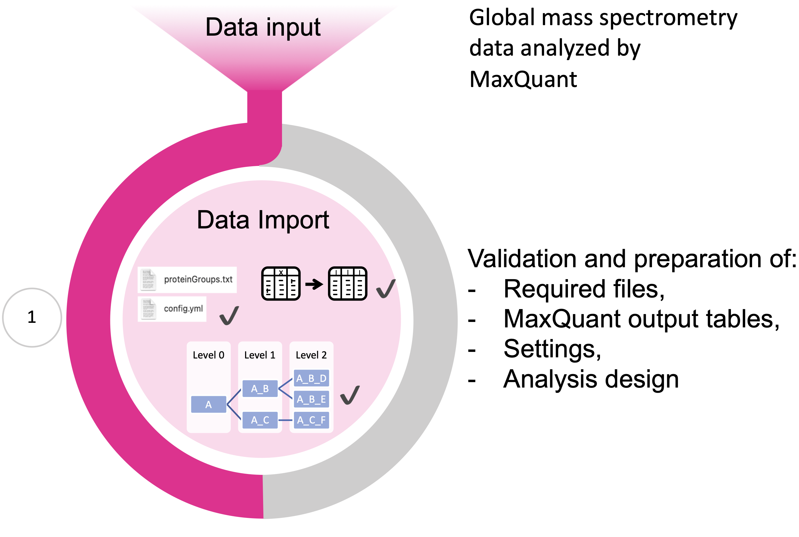
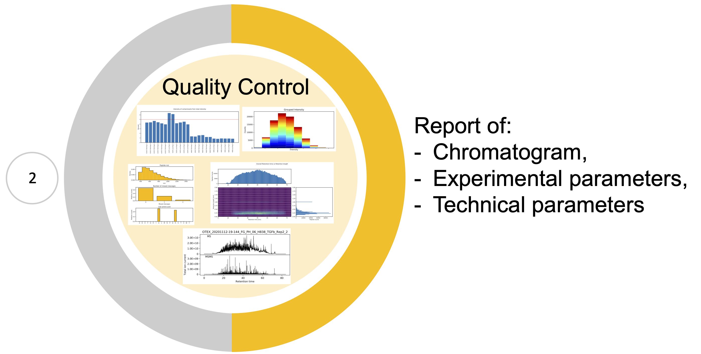
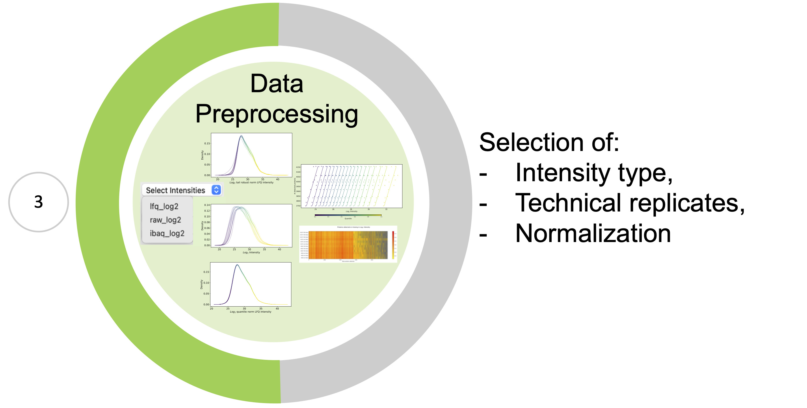
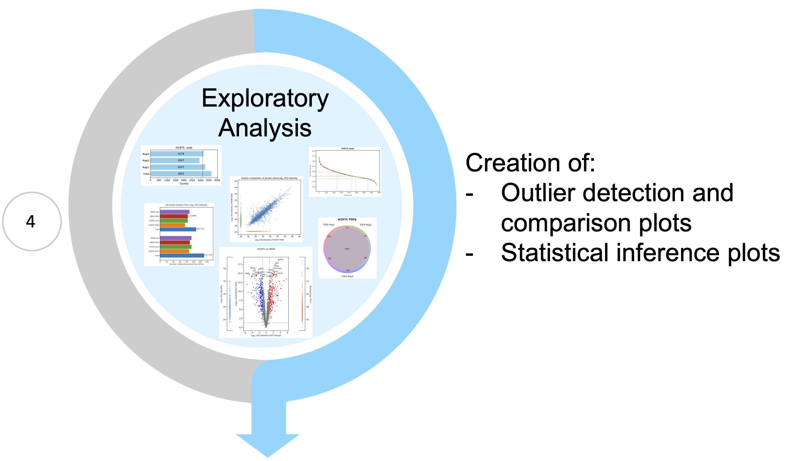

.. _workflow:

Workflow
========

Data import
~~~~~~~~~~~

| First, the data needs to be imported.
| Currently the ``mspypeline`` package supports the analysis of label-free shotgun proteomics analyzed by the
  `MaxQuant software <https://www.maxquant.org>`__. For a complete analysis, the ``mspypeline`` package deploys several
  MaxQuant output tables, however, the
  **minimal requirement to perform exploratory analysis is only the proteinGroups.txt file** that contains aggregated
  protein intensities.

| Since several different mass spectrometry techniques exist and other software programs like MaxQuant are applied a
  number of different file formats containing mass spectrometry data exist. So far, analysis of files with other formats is not
  supported as ``mspypeline`` requires a strictly followed internal data format.
| For this purpose, :ref:`FileReaders <file-readers>` are involved that translate the particular format of each file
  into the internal file format. Until now, only a :class:`~MQReader` is provided.
| The :class:`~MQReader` can reformat several output tables provided by MaxQuant including the following text files:

  * proteinGroups
  * peptides
  * summary
  * parameters
  * msScans
  * msmsScans
  * evidence

| If present, these files are utilized to generate the :ref:`quality control report <max-quant-report>`.
| Upon data import the data gets internally formatted and prepared for the analysis. Default preparation of the data by
  the :class:`~MQReader` includes:

  * the removal of "Reverse" proteins, those "Only identified by site" or marked as "Potential contaminant"
  * proteins that are missing both an identified gene name and a FASTA header are discarded
  * intensities of proteins assigned with an identical gene name (duplicates) are handled (sum or drop).

| These default configurations can be customized by the user in accordance with their preferences.
| During the attempt to import the data, a first quality test is performed, which verifies whether all required files
  and directories are provided and if they are correctly structured.

.. tip::
    * To perform data analysis with different intensity types (e.g. LFQ or iBAQ) it is necessary to specify these
      options for the MaxQuant analysis.
    * It is recommended to select the information of FASTA file headers for the detected proteins as ``mspypeline`` will
      use the gene name annotation therefrom to index the detected proteins.
    * To ensure proper analysis the samples of the experiment have to be named according to the
      :ref:`naming convention <analysis-design>`.

.. warning::
    * the output folder, called *txt*, and all contained files from a MaxQuant run must not be renamed or the analysis
      will not work.

.. _max-quant-report:

Quality control
~~~~~~~~~~~~~~~

| Following data import it is recommended to first prepare a control report on the raw data in order to obtain a
  preliminary impression of the data quality. This quality control report is specifically designed to process the
  information from the distinct MaxQuant files (if available) to generate a multi-page pdf document. Here, the quality
  of the raw data can be investigated of both experimental and technical MS specific parameter.
| Such a quality control is provided by the :ref:`MaxQuant plotter <plotters>`. An exemplary MaxQuant report is provided
  in the :ref:`gallery <mqreport>`.

.. _hyperparameter:

Data Preprocessing
~~~~~~~~~~~~~~~~~~~

| Data may be processed in multiple ways and this can substantially alter the results of your analysis.
| Data preprocessing available in mspypeline comprises:
  * the choice of protein intensities provided by MaxQuant: raw, label-free quantification (LFQ) or intensity-based absolute quantification (iBAQ) intensities
  * averaging technical replicates
  * removal of erroneous samples
  * normalization and standardization of the data set.

Intensity options
******************

* LFQ Intensity ("lfq_log2")
* raw Intensity ("raw_log2")
* iBAQ Intensity ("ibaq_log2")

| Regardless of the choice of protein intensity, the GUI handles all data in log2 format. However, it is possible to analyze
  the data without log2 scale ("lfq", "raw", "ibaq") if advanced data analysis is performed by interacting with the package programmatically.

Normalization options
*********************

* No normalization
* Median Normalization via: :class:`~mspypeline.MedianNormalizer`
* Quantile Normalization with missing value handling via: :class:`~mspypeline.QuantileNormalizer`
  and :func:`~mspypeline.interpolate_data`
* Tail Robust Quantile Normalization (TRQN) via: :class:`~mspypeline.TailRobustNormalizer` and
  :class:`~mspypeline.QuantileNormalizer`
* TRQN with missing value handling via: same as above and :func:`~mspypeline.interpolate_data`
* Tail Robust Median Normalization via: :class:`~mspypeline.TailRobustNormalizer` and
  :class:`~mspypeline.MedianNormalizer`

| To aid the determination of the best possible normalization method, two plots may be created:
  :meth:`~mspypeline.BasePlotter.plot_normalization_overview` and
  :meth:`~mspypeline.BasePlotter.plot_heatmap_overview_all_normalizers`.
| These methods will output a multipage PDF file in which the data is plotted repeatedly after applying the different
  normalization options. Thereby it is possible to get a better understanding of the effect of each normalization method
  on the data.
| Please read the function description explaining how normalized data should look like. Once a normalization method is
  chosen, it is highly recommended to perform all further analysis with the same normalized data.

Exploratory Analysis
~~~~~~~~~~~~~~~~~~~~~

Create outlier detection and comparison plots
**********************************************

| The descriptive and comparison plots can for example help to analyze how biological replicates compare to each other or
  how different conditions effect detected proteins.

Create statistical inference plots
**********************************
| Statistical inference plots can inform about differential protein intensities between groups of the data set.
  The calculation of statistical significances of the variation of protein intensities between groups can help to
  exploit biological questions by incorporation the functional profile of proteins or protein sets.
| Statistics for each plot are calculated based on the intended usage of the plot.

* for the :meth:`~mspypeline.BasePlotter.plot_pathway_analysis` an independent t-test is applied
* for the :meth:`~mspypeline.BasePlotter.plot_go_analysis` a fisher'S exact test is applied
* for the :meth:`~mspypeline.BasePlotter.plot_r_volcano` plot the moderated t-statistics is applied which is
  implemented by the R package limma. Additional R packages might
  be downloaded when this plot is created for the first time.

Select pathways and GO-Terms of interest
^^^^^^^^^^^^^^^^^^^^^^^^^^^^^^^^^^^^^^^^^

Select :ref:`pathway-proteins`. Selected pathways has following effects:

* for the :meth:`~mspypeline.BasePlotter.plot_pathway_analysis` one plot per pathway is created
* in the :meth:`~mspypeline.BasePlotter.plot_rank`, if a protein is found it is marked on the plot
  and colored by the pathway
* in the :meth:`~mspypeline.BasePlotter.plot_r_volcano`, if a pathway is selected, proteins of that pathway are
  annotated in the plot instead of the most significant proteins that are annotated by default

Select :ref:`go-term-proteins`. Selected GO-Terms has following effects:

* for the :meth:`~mspypeline.BasePlotter.plot_go_analysis` one additional barplot is added per GO term

